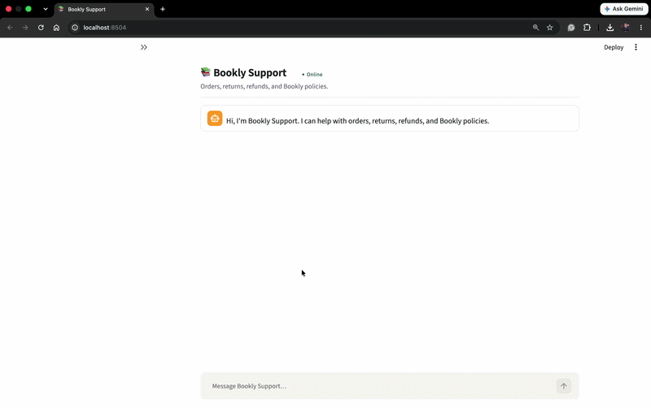
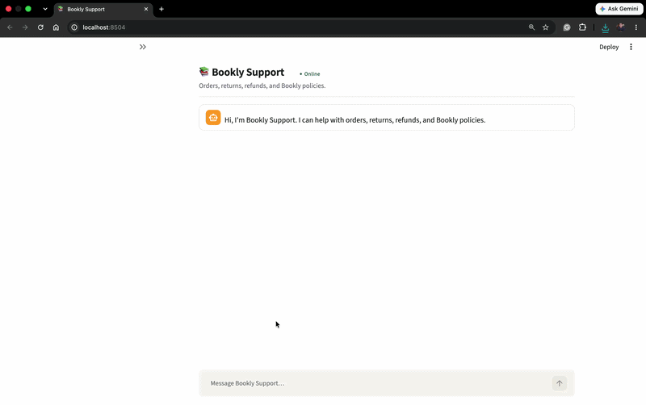
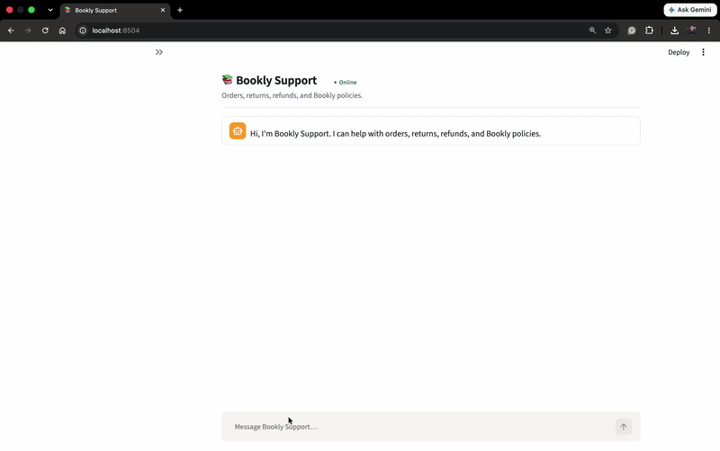

# Bookly Support Agent

Bookly is a fictional online bookstore. This repository is a working prototype of its customer support agent.

> Flexible in conversation. Controlled in action.

> The model decides how to communicate. The system decides what is true and what is allowed.

Claude handles language: understanding what the customer wants, asking a clarifying question, choosing a tool, explaining a result. Trusted Python code handles everything that has to be true or safe: who the customer is, what they own, what the policy says, and whether anything gets written. The interesting part of this project is that boundary, not the chat UI in front of it.

## What this demonstrates

- Multi-turn conversation that carries context — identity, the order under discussion, an open return — across turns.
- Clarifying questions before acting, rather than guessing which book "my order" refers to.
- Explicit, narrow tool use: the model can only ever call one of six functions, each doing one job.
- Deterministic business guardrails: identity, ownership, eligibility, and confirmation are all decided in Python, not by the model.
- Explainable policy decisions, backed by a real graph traversal rather than a paragraph in a prompt.
- A state-changing action (opening a return) that is idempotent and cannot be triggered without a prior eligibility check and an explicit yes.

This is one journey taken deep rather than many taken shallow — the return/refund flow is fully guarded end to end; breadth outside it is intentionally limited.

## Supported journeys

- Order discovery and order status
- Return/refund eligibility checks
- Return initiation
- Bookly policy questions (return windows, ebook vs. physical, regional overrides)
- Escalation to a human

## Architecture at a glance

```
Customer
   ↓
Streamlit UI
   ↓
Bookly Agent
   ├─ Prompt         (behaviour + boundaries)
   ├─ Routing        (Haiku / Sonnet)
   ├─ Memory         (trusted state outside the model)
   ├─ Orchestration  (LLM-directed tool loop)
   └─ six explicit tools
          ↓
   Deterministic Controls
   ├─ identity & ownership
   ├─ policy & eligibility
   ├─ confirmation
   └─ idempotency
          ↓
   Data & Policy Sources
   ├─ transactional JSON data
   └─ Neo4j policy graph
```

- One agent, not a multi-agent system.
- Six explicit, model-callable tools — nothing else is reachable.
- Neo4j is the shared policy truth — the runtime source of both policy answers and eligibility decisions.
- A trusted `SessionState` keeps mutation-critical state (identity, tokens, confirmation) outside the model's reach.
- The Agent Trace panel shows model, route, tools, latency, and policy path — operational visibility, not chain-of-thought.

[Read the detailed architecture](docs/architecture.md)

## Six tools

Exactly six tools are exposed to the model:

| Tool | Purpose |
| --- | --- |
| `verify_identity` | Verify the customer and establish trusted identity context |
| `lookup_order` | Discover owned orders or retrieve a specific order |
| `search_policy` | Answer informational Bookly policy questions |
| `check_return_eligibility` | Deterministically evaluate return eligibility |
| `initiate_return` | Create an idempotent return after trusted confirmation |
| `escalate_to_human` | Create a human support case |

## Trust boundary

The LLM can:
- understand intent
- ask clarifying questions
- choose tools
- explain results

Deterministic Python controls:
- verified customer identity
- order ownership
- policy truth
- eligibility
- eligibility tokens
- confirmation
- mutations
- idempotency

> The model has conversational freedom, not authority over business truth.

[Read the design decisions and tradeoffs](docs/design-decisions.md)

## Demo Scenarios

### 1. Order discovery and clarification

**Try:**

"I want to return my order"

**Watch for:**

identity collection, automatic order discovery once verified, and a clarifying question only when the item is genuinely ambiguous.


### 2. Mixed eligibility

Use Bruce:

`bruce@example.com`

Order:

`ORD-1003`

**Watch for:**

the physical book on the order is eligible, the ebook on the same order is not, each is decided by its own policy path, and only the eligible item can proceed to a mutation.



### 3. Multiple eligible returns

Use Kenji:

`kenji@example.com`

**Watch for:**

two separate orders, each checked independently, both surfaced as eligible, a single confirmation that covers both selected returns, and two item-scoped `initiate_return` calls.



### 4. Policy question

**Try:**

"What is Bookly's return policy in Australia?"

**Watch for:**

the agent answers using `search_policy`, resolves the applicable policy from Neo4j, explains the policy clearly, and does not enter a transactional return flow or request unnecessary identity verification.



Eligibility tokens are never shown to the customer or exposed in Agent Trace; they remain only in trusted server-side state.

[See the full demo guide](docs/demo-guide.md)

## Run locally

```bash
python -m venv .venv
source .venv/bin/activate
pip install -e ".[dev]"
cp .env.example .env
```

Fill in `.env`:

```
ANTHROPIC_API_KEY=
ANTHROPIC_MODEL_HAIKU=
ANTHROPIC_MODEL_SONNET=
ANTHROPIC_TEMPERATURE=
NEO4J_URI=
NEO4J_USERNAME=
NEO4J_PASSWORD=
```

`ANTHROPIC_TEMPERATURE` is optional and should usually stay blank — current Claude models manage their own sampling. Everything else is required; the agent fails at startup, not on the customer's first message, if any of it is missing.

Seed the policy graph (Neo4j must be running and reachable at `NEO4J_URI`):

```bash
python neo4j/ingest.py
```

Run the app:

```bash
streamlit run app.py
```

```bash
python scripts/reset_demo.py
```

The reset script restores `data/returns.json` and resets the demo token store. When running the Streamlit app, use the sidebar **Reset demo** button to also reset the active conversation state.

## Tests

```bash
pytest -q
```

Integration tests that run against a real, seeded Neo4j instance (skipped automatically if it's unreachable):

```bash
pytest -m integration -q
```

## Documentation

- [Architecture](docs/architecture.md)
- [Design decisions and tradeoffs](docs/design-decisions.md)
- [Demo guide](docs/demo-guide.md)
- [Production roadmap](docs/production-roadmap.md)

## Prototype scope

Bookly is fictional. Customer, order, and return data are mocked JSON fixtures, not a real order system. Neo4j holds the runtime policy graph and is the source of truth for return rules and eligibility, but it is seeded from a small fixture, not a real policy management system. Email-based identity verification is mocked and is not production authentication. The Australian policy example (`AU_BOOKLY_EXTENDED_RETURN`) is a fictional Bookly commercial policy, not a statement of Australian consumer law. This is a prototype built to demonstrate an interaction and control model, not production infrastructure.
