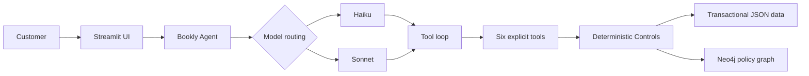

# Architecture

[← Back to README](../README.md)

## 1. Design thesis

Flexible in conversation. Controlled in action.

Bookly's agent gives the model full latitude over language: how to phrase a question, when to ask for clarification, how to explain an eligibility decision. It gives the model no latitude over business truth. Whether a customer is who they say they are, whether they own an order, whether an item can be returned, and whether a return is actually written are all decided by plain Python functions the model cannot see inside and cannot override.

That split exists because a support agent's failure modes are asymmetric. A slightly awkward sentence costs nothing. A model that invents a return window, skips a confirmation, or resolves a "yes" against the wrong pending item costs Bookly a return it didn't agree to. So the system draws the line before generation: the model requests an action, Python decides whether the action is real, and the model is only ever shown the result of a decision it did not make.

## 2. Customer inquiry flow

```
customer message
→ Streamlit UI
→ Bookly Agent (deterministic routing, LLM-directed tool loop)
→ tool selection
→ Deterministic Controls
→ Data & Policy Sources
→ compact tool result
→ model explanation
→ Agent Trace
```



Each customer message becomes one call to `BooklyAgent.respond`. It updates confirmation state from the *previous* turn's question before the model even sees the new message, routes the turn to a model tier, then runs a bounded loop against the Anthropic Messages API: call the model, run whatever tools it asked for, feed the results back, repeat until the model replies with plain text. Every tool call is traced — tool name, sanitized arguments, status, latency, and (for eligibility checks) the policy decision — regardless of whether the call succeeded, was blocked, or failed.

## 3. The Bookly Agent: Prompt, Routing, Memory, Orchestration

Bookly runs as **one agent**, not a multi-agent system: a single Python class (`agent/agent.py`) holding a hand-rolled loop against `anthropic.Anthropic().messages.create`. There is no agent framework and no second model in the loop — the loop, the system prompt, and the tool dispatch are one file, in the order they execute. Inside that one agent, four parts do distinct jobs: **Prompt** (behaviour + boundaries, [section 7](#7-prompt-boundary)), **Routing** (Haiku / Sonnet, below), **Memory** (trusted state outside the model, [section 5](#5-trusted-session-state)), and **Orchestration** (the LLM-directed tool loop itself).

**Routing is deterministic**, not model-decided. `select_model` inspects session state and the message text against keyword lists and returns a tier plus the one reason that decided it:

- **Haiku** handles simple, read-oriented turns — a plain policy question, a first "what's my order status".
- **Sonnet** handles turns with return/refund intent, ambiguity to resolve, escalation language, an open workflow, or a conversation past six user turns.

The router is intentionally asymmetric: every ambiguous case promotes to Sonnet. A false promotion costs a fraction of a cent; a false demotion risks a wrong eligibility explanation or a dropped thread mid-return. No LLM call decides which LLM to use — that would add latency and make the decision unreproducible.

**Reliability and cost mechanics**, all in `agent/agent.py`:

- A 30-second timeout per Anthropic call and up to 2 SDK-managed retries, for an honest "I can't reach our systems" instead of an indefinite wait.
- A hard cap of 6 tool-loop iterations per turn — comfortably above the longest real path (verify → look up → check eligibility → return) — after which the agent says it is stuck and offers a human.
- Automatic prompt caching (`cache_control: {"type": "ephemeral"}`). Tool schemas render first, then the fixed system prompt, then the growing transcript, so the stable prefix is cached and later turns don't reprocess it.
- Tool results sent to the model are compact, hand-projected views (eligibility responses omit the policy path and the token) rather than full serialized objects — smaller prompts, and nothing repeated the model has no use for.

## 4. Tools

Six tools, and only six, are on the model's schema (`agent/tools.py`). They split into two kinds:

**Read/discovery tools** — safe to call freely, no mutation:
- `verify_identity` — matches an email against the mock customer store and returns identity + region. Says nothing about orders.
- `lookup_order` — a verified customer's orders (no `order_id`) or one order in full detail (with it). Ownership is checked in the function itself, not assumed from the caller.
- `search_policy` — informational-only lookup against the same policy resolver `check_return_eligibility` uses, so the two answers can't disagree.
- `check_return_eligibility` — decides whether one item on one order is returnable, and issues a single-use eligibility token when it says yes.

**State-changing tools**:
- `initiate_return` — the only write in the tool set. Requires a valid, matching eligibility token and an explicit `confirmed=True`, both supplied by the loop from trusted state, never by the model. Refuses a second write against an item that already has an open return, returning the existing RMA instead.
- `escalate_to_human` — creates a mocked case reference. Works even without identity, since a customer who can't verify is exactly who needs a person.

The JSON schema shown to the model is deliberately narrower than the Python function signature: fields like `customer_id`, `eligibility_token`, and `confirmed` are not model-settable arguments at all. `invoke_tool` injects them from `SessionState`, so a model that hallucinated `confirmed=true` has nothing to hallucinate it *into*.

## 5. Memory: trusted state outside the model

`SessionState` (`agent/state.py`) is the only mutable thing the agent carries between turns, and it is the agent's Memory: trusted state that lives outside the model, not something the model can read from or write to directly. It holds, among other fields:

- `verified_customer_id` / `customer_region` — set only from a successful `verify_identity` call.
- `active_order_ids` / `active_order_id` / `active_item_id` — which orders and item are currently under discussion.
- `pending_returns` — one entry per item that has passed an eligibility check and is awaiting the customer's yes, each carrying its own `eligibility_token`, `asked`, and `confirmed` flags. A session can hold several at once (e.g. two eligible items from Kenji's two orders), and confirming one never confirms another.
- `escalated` — true only once `escalate_to_human` has actually returned a case id.
- `transcript` — the full Anthropic-facing conversation, including tool blocks, kept separate from `messages`, the customer-facing view.

Every trusted field is written in exactly one place — `apply_tool_result` — and only from a tool call that returned `ToolStatus.OK`. A blocked guard, a rejected call, or a failed one leaves state untouched. This is session-scoped, in-memory state held for the life of one Streamlit tab — not durable production memory, and not a customer profile store.

## 6. Data & Policy Sources: Neo4j as shared policy truth

Neo4j is the shared policy truth — the single runtime source both tools resolve against (`policy/graph.py`, `policy/policy.py`). Categories (`PhysicalBook`, `EBook`) are governed by policies; regions can override into a more specific policy for their customers; policies can outrank one another by precedence. Both `search_policy` (informational) and `check_return_eligibility` (transactional) resolve through the same `applicable_policies` function, so an answer about "what's the return window in Australia" and a decision on an actual Australian customer's order cannot disagree — a bug class the shared resolver was written specifically to close. The same resolution logic backs an informational FAQ answer and a customer-specific eligibility decision; there is one policy truth, not two.

There is no JSON fallback. If Neo4j is unconfigured or unreachable, the tools raise `PolicyGraphUnavailableError` and the agent tells the customer it can't confirm the policy right now rather than answering from a guess or a stale fixture. `neo4j/policy_graph.json` and `neo4j/seed.cypher` are fixtures for `neo4j/ingest.py` to load at setup time — nothing at runtime reads them directly.

## 7. Prompt boundary

The system prompt (`agent/agent.py`) governs conversational behavior: ask for identity before sharing account details, resolve ambiguity with one question at a time, treat tool output as the only source of facts, confirm explicitly before opening a return, never claim an action succeeded unless the tool said so, and escalate when a request is out of scope or a tool keeps failing.

No business rule is written in the prompt. There is no return window, no regional override, and no precedence order stated there — those live in Neo4j and are read by the tools. The prompt asks the model to request confirmation because that's the conversational experience a customer should have; it is not what makes confirmation binding. `confirmed` is computed in Python from the actual exchange (`is_affirmative`, `asks_for_confirmation`) and enforced again inside `initiate_return` itself. If the model ignored every instruction in the prompt, no return could open — the prompt shapes the conversation, it does not gate the mutation.

The model can request an action. It cannot authorize one. That is the whole job of Deterministic Controls (identity & ownership, policy & eligibility, confirmation, idempotency): every request the model makes passes through plain Python that decides, independently of what the model said, whether the action is real.

## 8. Observability

The Agent Trace (rendered in `ui.py`, populated in `agent/agent.py` and `agent/state.py`) shows, per assistant turn:

- the selected model and the routing reason
- each tool called, in order, with sanitized arguments, status, and latency
- for an eligibility check: the policy and the policy path — a business-friendly decision path (input context → applicable policy → blocker, if any → final decision), not a raw graph traversal. For example: `PhysicalBook + AU → AU_BOOKLY_EXTENDED_RETURN → Eligible`, or `EBook → DIGITAL_NO_RETURN → Not eligible`.
- mutation outcomes (return id, case id) and errors, when they occur

Arguments and log lines are sanitized before they're ever stored: emails are masked to their first character and domain, and fields like `eligibility_token` are redacted outright, whatever their value.

Agent Trace is operational execution visibility, not chain-of-thought. No model "thinking" content is requested, stored, or shown anywhere in this repository — the trace reflects what actually ran (tool name, arguments, result, timing), never a narrated reasoning process.
