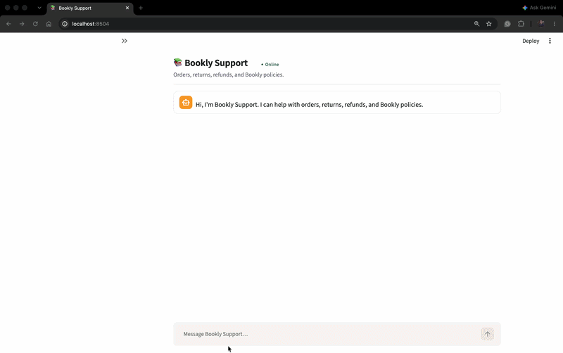

# Demo Guide

[← Back to README](../README.md)

## Reset the demo

Two resets exist, and they are not the same thing:

- **"Reset conversation"** (sidebar button) — clears the chat only. Any return opened during the conversation stays on record.
- **"Reset demo"** (sidebar button, or `python scripts/reset_demo.py` from the command line) — restores `data/returns.json` to its seeded state and clears every in-memory eligibility token, in addition to clearing the conversation. Use this between demo runs so a return opened in a previous run doesn't block the same scenario from repeating.

Run it fresh before recording or presenting a demo.

## Demo accounts

| Customer | Email | Region | Notes |
| --- | --- | --- | --- |
| Bruce Chen | `bruce@example.com` | AU | Order `ORD-1003` has a physical book and an ebook — the mixed-eligibility scenario. |
| Kenji Watanabe | `kenji@example.com` | US | Two orders, `ORD-1006` and `ORD-1008`, each with one physical book — both currently eligible. |

Other seeded customers (`ada@example.com`, `sofia@example.com`) exist to exercise edge cases in tests — an expired return window, an in-transit order, multiple active orders requiring clarification — but aren't needed for the four scenarios below.

## 1. Order discovery and clarification

**Purpose:** show identity collection and automatic order discovery, with a clarifying question only when the item is genuinely ambiguous.

**Try:** *"I want to return my order"*

Expected flow:
1. The agent asks for the email on the account.
2. `verify_identity` runs and succeeds.
3. `lookup_order` runs automatically with no order id, listing the customer's orders and the items on each.
4. If the customer named a book that appears on only one order, the agent proceeds with that item directly. If it's ambiguous — the title appears on two orders, or the customer hasn't named one yet — the agent asks one clarifying question.

**Watch for:**
- Identity and order discovery are separate tool calls with separate responsibilities — verifying who someone is says nothing about what they own.
- The customer never needs to know or supply an order id; the agent resolves a title to an order and item id on its own.

**Trust/control behaviour:** identity is verified before any order data is returned; order discovery and clarification are handled deterministically, not guessed by the model.

**GIF:**

## 2. Mixed eligibility

**Purpose:** show that eligibility is decided per item, via its own policy path, not per order.

**Identity / order:** verify as Bruce (`bruce@example.com`), then ask about order `ORD-1003`.

Expected outcome:
- The physical book on the order is eligible (Bruce's AU account gets a regional extended-return policy that covers it).
- The ebook on the same order is not eligible (ebooks have no return window at all).
- Only the eligible item is offered for confirmation and can proceed to `initiate_return`.

**Watch for:**
- Both eligibility decisions come from the same policy resolver, evaluated independently per item.
- One ineligible result in the same turn does not overwrite or cancel the eligible one.
- The Agent Trace shows each `check_return_eligibility` call with its own policy id and policy path.

**Trust/control behaviour:** only the item that clears eligibility can proceed to a mutation; the ineligible item is never offered `initiate_return`.

**GIF:** `assets/demos/bruce-mixed-eligibility.gif`

## 3. Multiple eligible returns

**Purpose:** show independent eligibility checks and item-scoped mutations across multiple orders in one turn.

**Identity:** verify as Kenji (`kenji@example.com`) and ask about returning items on both of his orders.

Expected outcome:
- Two orders are discovered, each checked independently, and both come back eligible.
- The agent asks a single confirmation question covering both selected returns (or names them individually — either is valid).
- A "yes" to that question confirms both pending returns; each still requires its own `initiate_return` call.
- Two separate, item-scoped return records are created.

**Watch for:**
- A conversational "both" resolves to two backend-tracked pending returns, each with its own eligibility token — a "yes" to one never silently authorizes the other.
- The two `initiate_return` calls are independently guarded; the first one succeeding does not consume or clear the second, still-pending return.

**Trust/control behaviour:** two item-scoped `initiate_return` calls, each requiring its own eligibility token and confirmation — no shared or implicit authorization between them.

**GIF:** `assets/demos/kenji-multi-return.gif`

## 4. Policy question

**Purpose:** show a read-only policy lookup that never enters a transactional flow.

**Try:** *"What is Bookly's return policy in Australia?"*

Expected flow:
1. The agent calls `search_policy`, which resolves the applicable policy from Neo4j.
2. The agent explains the policy in plain language.
3. No eligibility check, confirmation, or `initiate_return` call occurs.

**Watch for:**
- `search_policy` and `check_return_eligibility` share the same Neo4j-backed resolver, so the informational answer and any later eligibility decision can't disagree.
- The agent does not request identity verification for a question that doesn't require customer-specific context.

**Trust/control behaviour:** a purely informational question stays informational — no eligibility token is created, and no transactional tool is called.

**GIF:** `assets/demos/policy-question.gif`

## Agent Trace

For each scenario, expand the "Agent trace" panel under the assistant's reply and look for:

- **Model tier** — Haiku for the plain lookup, Sonnet once return intent, ambiguity, or a pending confirmation is in play — and the one-line routing reason.
- **Tool calls, in order** — name, sanitized arguments, status (success / blocked / rejected / failed), and latency.
- **Policy decision** — for `check_return_eligibility`, the policy id, eligible/not eligible, and the policy path (input context → applicable policy → blocker, if any → final decision).
- **Mutation result** — for `initiate_return`, the RMA reference and whether it was newly created.

Nothing sensitive is shown: emails are masked to their first character and domain, and eligibility tokens never appear in the trace or the reply, only inside the server-side state that enforces them.
